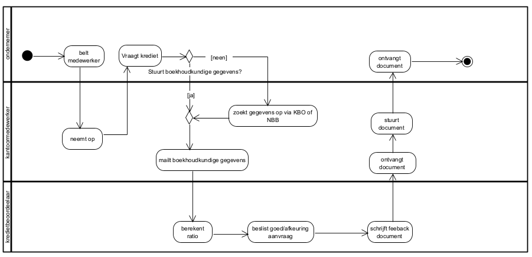
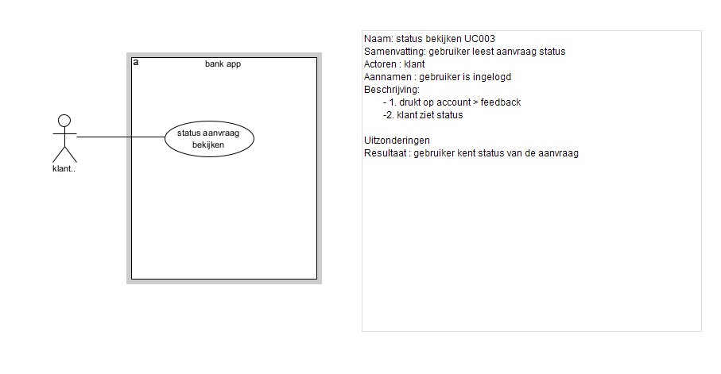
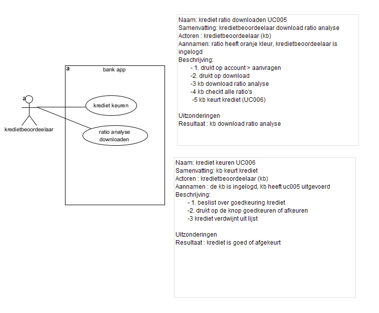
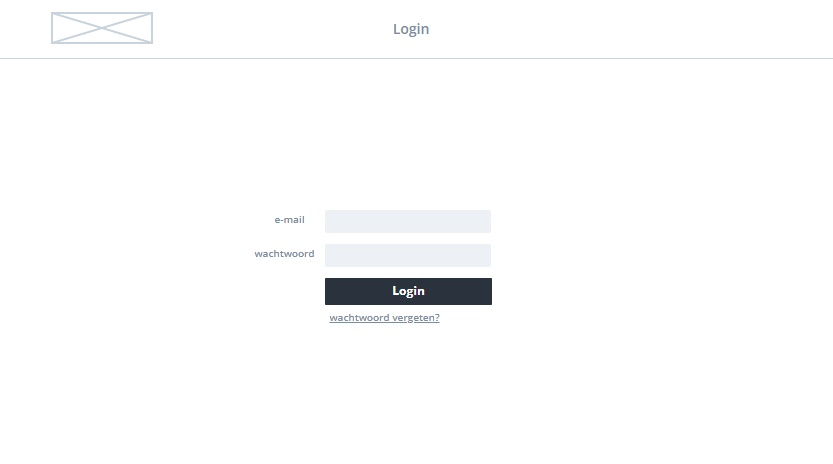
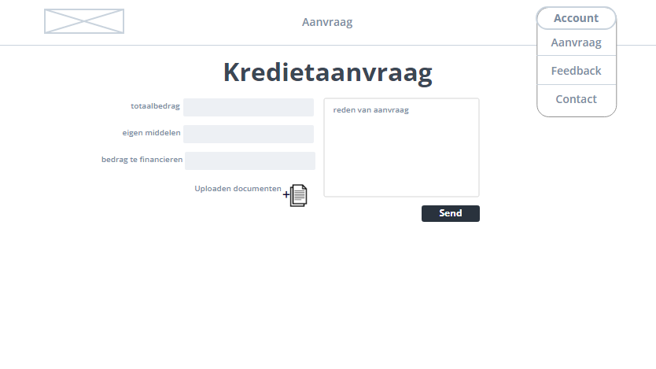
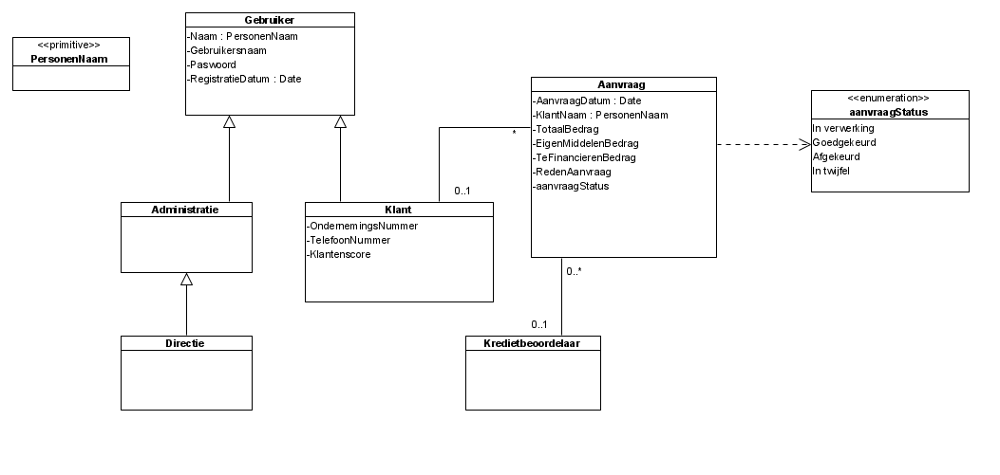
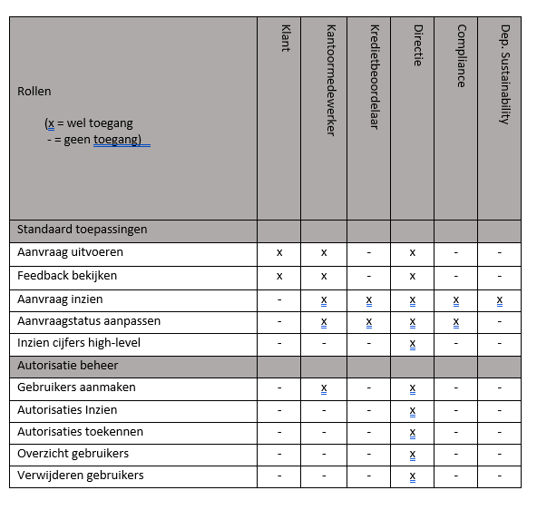

# blueprint-bravo-six
blueprint-bravo-six created by GitHub Classroom

# Project inleiding

Thomas Boyens - Jens Baeten\
2ITBUS\
2021-2022 - Project analyse

Product Owners:
- Valentijn Brasseur
- Tine Van Hauwermeiren

Proxy Product Owners:
- Kaoutar Amezian
- Fadoua El-jattari 

<!--[Digitaal kredietaanvraagproces\ Boyens Thomas, Baeten Jens\ Traject ITBUS\ 2021-2022\ Product owner + proxy product owner]
-->
# Opdrachtgever
De product owners en de opdrachtgevers in dit project zijn Valentijn Brasseur en Tine van Hauwermeiren. Zij zijn de CTO en CIO van de Doekoe bank. Dit project werd aangevraagd door hun omdat het huidige proces veel te arbeidsintensief is. Op dit moment doet de kantoormedewerker alles manueel. Daarom vroegen ze ons om een web applicatie te ontwikkelen die hun kredietaanvragen kan automatiseren. De proxy owners zullen alle requirements die de product owners hebben communiceren naar Boyens Thomas en Baeten Jens, zij zijn de twee full stack developers die aan dit project zullen werken.

<!-- 
// oude tekst 
De product owner is de opdrachtgever en eindverantwoordelijke van het product. Ook bepaald de PO de scope, product backlog, budget, visie en strategie van de applicatie. Ze zullen ook de voortgang monitoren (van de applicatie) omdat we agile te werk gaan. De proxy product owner is de tussenpersoon en zullen de activiteiten van de product owner in het project overnemen zo zullen zij in dit project de product backlog, scope en monitoring begeleiden. Zij zullen alles rapporteren aan de product owner omdat ze zelf niet eindverantwoordelijk zijn.
-->

<!--
[De opdrachtgevers van het project en hun rol in het project. Benoem de product owner met bijhorende functie. Waarom heeft deze persoon nood aan dit project en vanwaar de betrokkenheid in dit project?] -->

# Samenvatting
<!--[Korte samenvatting van het project en context, 1 of 2 alinea's. Best op het einde pas schrijven als de blueprint klaar is. Maak een inleiding met de aanleiding van het project, het doel en wat daarvoor ontwikkeld wordt.]-->

# Situatie As-Is

## Huidig proces
Het huidig proces is nog niet gedigitaliseerd.
In het huidige werkproces vraagt een ondernemer krediet aan via de kantoormedewerker. De kantoormedewerker vraagt de gegevens van de klant. Heeft de klant de gegevens niet dan zoekt de medewerker de boekhoudkundige gegevens van de klant zelf op via de kruispuntenbank van ondernemingen en stuurt een mail met de gegevens van de klant naar de kredietbeoordelaar. Met deze gegevens berekent de kredietbeoordelaar boekhoudkundige ratio's in Excel en beslist of krediet wordt toegekend of niet. Aan de hand van deze ratio's schrijft de kredietbeoordelaar een feedbackdocument ten behoeve van kantoor en klant. Dit feedbackdocument wordt via de medewerker naar de ondernemer gestuurd.

<!-- 
[De beschrijving van het huidig proces of de huidige werkwijze en probleemstelling. Het huidig werkproces kan een handmatig proces zijn, eventueel deels gedigitaliseerd, of volledig gedigitaliseerd. Als er nog geen project is, dan beschrijf je het werkproces dat nu gebruikt wordt. Ook dit dient volledig geanalyseerd te worden ahv procesflows (activity diagram bv met swimlanes of sequence diagrams). Begeleidend schrijven is noodzakelijk ter verduidelijking van de flow, het beschrijven van de plaatsen waar het op dit moment mis loopt of problemen vastgesteld worden.]
[TIP ! Dit kan m.b.v. diagrammen zoals activiteitsdiagrammen voor processen, BPMN, toestandsdiagrammen voor toestandsveranderingen, sequentiediagrammen...]  -->

## Probleemstelling

De kredieten worden momenteel manueel door een medewerker verwerkt en goedgekeurd, dit is zeer arbeidsintensief. Doordat de medewerker allerlei berekeningen zelf moeten uitvoeren ontstaat er een foutgevoeligheid. Het huidige proces is ook te traag, de klant wil sneller een beslissing of indicatie of hij/zij goed- of afgekeurd is. De kredietbeoordelaar verliest veel tijd omdat hij/zij voor elke kredietaanvraag een persoonlijk feedbackdocument moet schrijven.
  
<!-- 
[De probleemstelling beschrijven aan de hand van dit huidig proces is belangrijk. Je kan bv afleiden uit de huidige manier van werken dat het foutgevoelig is, beperkingen heeft, veel manueel werk vereist, omslachtig werken is, dat het innovatie in de weg staat, enzovoort. Luister hiervoor vooral naar jouw P(P)O over welke problemen zich allemaal voordoen op dit moment.]
-->

# Situatie To-Be

## Doelstelling
Met de ondernemingsnummer van de persoon die de kredietaanvraag doet zal de applicatie de laatste jaarrekening extern ophalen in de KBO (Kruispuntenbank van Ondernemingen) of NBB (Nationale Bank van België). Op basis van de jaarrekening worden ratio's berekent die hierna weergegeven worden in een automatisch gegenereerd, visueel attractief feedback document. De klant moet bij de kredietaanvraag het onderwerp beschrijven. Dit bestaat uit het totaalbedrag van het project, het deel dat de klant betaald met eigen middelen en het deel dat te financiëren valt. Ook zal de klant extra info moeten uploaden indien aanwezig zoals offertes en plannen in verband met het te financieren project.

<!-- 
Doelstelling {#doelstelling .list-paragraph}
[Beschrijf de doelstelling van het project. Dit is niet de ontwikkeling van de applicatie. De ontwikkeling van de I(o)T-applicatie is een middel om het doel te bereiken. Idealiter omvat de doelstelling een antwoord op de probleemstellingen uit de AS-IS situatie.]
-->
## Nieuw proces
 

# Projectdefinitie
Het digitale kredietaanvraagproces zal gerealiseerd worden als een webapplicatie. Dit houdt in dat een ondernemer (die klant is bij de bank) via de website een krediet kan aanvragen.
De applicatie zal Agile ontwikkelt worden, zo kunnen we na elke week bekijken wat we kunnen veranderen aan onze werkwijze en aan de applicatie zelf om de beste oplossing mogelijk te vinden voor de klant. 
Aan de start van het project zullen we streven naar een one-feature MVP waar de app de mogelijkheid bezit om een kredietaanvraag te doen. De berekeningen en functies die de app uiteindelijk zal moeten uitvoeren zullen nog tijdelijk gedaan worden door de medewerker. Stap voor stap zullen deze functies dan toegevoegd worden en zal het systeem de taken van de medewerker overnemen.

<!-- 
[Wat ga je juist maken? Indien je Agile werkt, kan je de Epics beschrijven, het Minimal Viable Product, ...]-->

## Scope 

### Must haves

### Gebruikers

#### UC001 Inloggen
- Als klant wil ik kunnen inloggen zodat ik een krediet kan aanvragen.

#### UC002 Kredietaanvraag
- Als klant wil ik een krediet kunnen aanvragen zodat de bank mij een lening kan toekennen.
- De klant vult het totale bedrag van zijn/haar project in, deel dat de ondernemer zelf betaald met (zijn/haar) eigen middelen en deel dat de bank moet financieren. Ook zal er een uploadzone voorzien zijn waar de ondernemer eventuele offertes/plannen kan uploaden met betrekking tot het te financieren project.

#### UC003 Status bekijken
- Als klant wil ik de status van mijn aanvraag kunnen bekijken zodat ik weet wanneer mijn aanvraag is goedgekeurd of afgekeurd.

#### UC004 Contract tekenen
- Als klant wil ik een contract kunnen ondertekenen zodat ik mijn kredietaanvraag kan goedkeuren en mijn aflossingstabel kan bekijken.
- Het ondertekenen van het krediet kan zowel online als op papier gebeuren. Indien er op papier getekend wordt moet het contract terug geupload worden.

#### UC005 + UC006 Ratio downloaden + krediet keuren
- Als kredietbeoordelaar wil ik de oranje gekleurde aanvragen kunnen bekijken en goed of afkeuren zodat ik de kredietaanvraag van de klant kan verwerken.

### Systeem
- Op basis van ondernemingsnummer zal de app de laatste jaarrekening ophalen bij de KBO of NBB.

- De app zal ratio's berekenen aan de hand van de opgehaalde jaarrekening. Deze berekende ratio's worden in een feedback opgeslagen en krijgen een kleurencode aan de hand van de cijfers. 

- De app houdt rekening met een lijst van uitzonderlijke sectoren waar onmiddelijke goedkeuring wordt gegeven of waar de aanvraag altijd naar de kredietbeoordelaar wordt gestuurd.

- De app creërt een intrestvoet aan de hand van de klantenscoren

- De applicatie stuurt het feedback document naar de klant via mail.

- De app stuurt aanvragen met een oranje uitslag naar de kredietboordeelaar voor beoordeling. 

### Nice to have
- De commerciele directie heeft toegang tot een overzicht van alle aanvragen en medewerkers om deze te kunnen beoordelen en aanpassen.

- Implementatie voor de Compliance afdeling zodat de app verdachte aanvragen aan hun meldt.

- Departement Sustainability dat toegang heeft tot een overzicht van de kredietaanvragen om duurzaamheid te controleren.

- Chat functie met een bot die je kan helpen indien je vragen hebt in verband met de kredietaanvraag.

- Een voorbeeldmodus van het contract met een scrollbar op de contractpagina.

 
<!-- 

*[Opsommen van de functionaliteit en onderdelen dit bij het
uitvoeren van het project horen. Probeer dit zo sluitend mogelijk te doen, dit voorkomt discussies.]*
Wat zijn de must-haves, Zijn er nice-to-haves? Prioriteiten?
Maak assumpties indien nodig.
[TIP ! Gebruik use case diagram en use case scenario's]

-->

## Niet in Scope 
 - Wij leveren geen hardware onderdelen, deze dienen door de klant zelf aangeschaft te worden. In aanvulling hierop zullen wij ook geen server onderhoud doen. Wij leveren alleen het eindproduct.

 - We zullen een aantal dagen training geven, zodat klant de applicatie kan leren gebruiken en de adoptie daarvan soepel verloopt.

 - De optie om met itsme in te loggen is niet mogelijk.

<!-- 
*[Expliciet vernoemen wat niet tot de draagwijdte (scope) van het
project hoort, bv. het aanleveren van onderdelen, opleiding, maintenance, onderhoud van servers, ...]*
-->
# Planning
Wij zullen agile te werk gaan in sprints van 2 á 3 weken aan de hand van de grootte van de product backlog. 
scrum of kanban?

<!-- 
[Agile of Waterfall? Scrum of Kanban? Wekelijkse sprints of per maand? Hoe omgaan met stories die niet goedgekeurd zijn op demo? Welke tools om alles op te volgen?]-->

## Hoofdlijnen 
We willen zo snel mogelijk een werkende app hebben met alle basis functies om het proces te kunnen uitvoeren. Hier zullen we ons in de eerste sprints mee bezig houden. Na we een werkende app hebben zullen we deze standaardfuncties verder uitwerken en verfijnen indien nodig en de nice to haves toevoegen rekening houdende met de resterende tijd die we over hebben. 

<!-- 
[Korte beschrijving van de planning met de grootste deadlines binnen het project.]-->

## Toelichting fases 
 
<!-- 
[Indien de planning in fases of iteraties verloopt, bespreek dan kort hoe deze opgebouwd zijn. Wanneer ga je analyseren, testen, wat doe je met feedback uit de demo's en sprintreviews, ...]
-->

# Functioneel design
De app heeft een simpel design zodat elke gebruiker er makkelijk mee overweg kan. De GUI moet zich automatisch aanpassen aan de hand van het apparaat waar de gebruiker de app op gebruikt. 
Wanneer u de app opent ziet u een inlogscherm. U kan inloggen met de inlogknop, indien u nog geen klant bent zal u een afspraak moeten maken bij de bank. Wanneer u uw wachtwoord bent vergeten is er ook een optie om via de link uw wachtwoord te wijzigen. Afhankelijk van de rol van uw account, biedt de applicatie verschillende functies. (UC001)

Na het inloggen als standaardgebruiker (ondernemer) zal er een startpagina verschijnen waar u een kredietaanvraag kan indienen, dit is hier aanwezig om het hoofdproces van de applicatie meteen toegankelijk te maken vanaf de klant is ingelogd. 
U dient de details van de aanvraag te beschrijven en de reden van de aanvraag tot krediet in te geven in de inputvelden. Er zal ook een uploadzone beschikbaar zijn om info zoals offertes en plannen voor het te financieren project te uploaden. Het systeem zal op basis van deze gegevens ratio's gaan berekenen die dan zullen resulteren in een feedbackdocument met een goedkeuring of afkeuring. (UC002)

 

Er is een drop-down menu beschikbaar waar u door op het bijhorende veld te klikken naar verschillende pagina's kunt navigeren.

Eens geretourneerd door de kredietbeoordelaar zal er een manier zijn voor standaardgebruikers en kantoormedewerkers om het feedbackbestand te lezen, deze bestanden vindt de gebruiker onder 'feedback' in het drop-down menu. Bij de kantoormedewerker zullen hier verschillende feedbackdocumenten te zien zijn van meerdere klanten. Gebruikers kunnen hier ook de status van hun aanvraag controleren. Wanneer de aanvraag op groen staat zal de gebruiker de mogelijkheid hebben om op de 'contract' knop te drukken. Dit lijdt de gebruiker naar de contractpagina en zal een automatische download starten van het beschikbare contract. (UC003)

Op de pagina van het contract kan men het contract digitaal ondertekenen of uploaden in de uploadzone indien op papier getekend. Met het downloaden van de aflossingstabel zal u een pdf gedownload krijgen met de volgende info: (UC004)
- Het geleend bedrag
- De interestvoet
- Het termijn
- De interval

De kredietbeoordelaar zal toegang hebben tot een lijst met alle oranje kredietaanvragen die naar hem zijn doorgestuurd. Als de kredietbeoordelaar één van deze aanvragen selecteert wordt een Excel-bestand gedownload. In dit document zijn alle ratio's beschreven met de juiste kleurcode, zodat de kredietbeoordelaar de onvoldoende gescoorde ratio's kan beoordelen. Daarna zal hij in de lijst een optie hebben om deze goed of af te keuren. (UC005 + UC006)

De commerciele directie kan het aantal aanvragen en het aantal direct goedgekeurde/afgewezen kredieten bekijken. Op basis van deze informatie kunnen zij hun medewerkers evalueren. De directie heeft ook beschikking over rollenbeheer. Zij kunnen in het overzicht van hun medewerkers voor elke persoon het wachtwoord en de rol wijzigen maar ook het account verwijderen.

De afdeling Compliance krijgt meldingen bij verdachte aanvragen (te grote bedragen, bepaalde sectoren vb kansspelen). Ze hebben toegang tot een lijst van verdachte meldingen. Wanneer men op een melding klikt kunnen ze de bedragen, oorsprong van de aanvraag, etc. evalueren om na te gaan of dit een frauduleuze aanvraag is. Ze hebben dan ook de mogelijkheid via een knop om deze aanvraag af te keuren en te rapporteren aan de NBB. 

Het Departement Sustainability heeft enkel toegang tot een overzicht van de kredietaanvragen in de vorm van een lijst. 

<!-- 
[Beschrijf hier wat er qua ontwerp opgenomen moet worden m.b.t. functionaliteit, bv. alle GUI-schermen moeten volgens de huisstijl opgebouwd zijn, maak dan ook ontwerpen voor de GUI en verduidelijk de schermen hier ook. Het is op die manier duidelijk voor de P(P)O wat hij/zij na het project kan verwachten. Bij review van deze mockups komt ook heel wat nuttige feedback van de P(P)O. Wat is de algemene lay-out, welke automatische acties moeten er achter je knoppen/processen zitten?]

[Verduidelijk ook business rules en beslissingen die het systeem neemt, achterliggende berekeningen die functioneel van belang zijn, logische keuzes die het systeem maakt op basis van ingevoerde info.]

[TIP ! Denk aan wireframes,mock-ups, toestandsdiagrammen, beslissingstabellen, activitydiagrammen.]
-->

# Technisch design

### Domain Class Diagram

## Frontend
Het Angular framework is onze voorkeurstechnologie voor de frontend omdat we deze we het beste kennen. Angular maakt gebruik van componenten en services. Door componenten te gebruiken, moeten we voor een functie eenmalig een lay-out ontwikkelen die we overal kunnen hergebruiken in de web applicatie. Door gebruik te maken van services kunnen we indien nodig eenvoudig verbindingen leggen tussen verschillende componenten. Angular is ook een veelgebruikt framework, dit betekent dat er veel informatie over te vinden is voor de ontwikkelaars. Dit maakt het eenvoudiger voor de developers om hun werk te doen en heeft ook als gevolg dat de tijd om de applicatie te maken gereduceerd kan worden.

## Backend
Java is de voorkeurstechnologie voor veel banken omdat het een hoog beveiligingsniveau en efficiënte verwerking van grote hoeveelheden gegevens biedt. Ook zijn we al wat gekend met deze taal en moeten we dit dus niet meer aanleren. Spring biedt een platform van verscheidene componenten klaar voor gebruik en nuttig voor webapps. Spring Security bijvoorbeeld maakt authenticatie en autorisatie vrij eenvoudig en krachtig, Spring Data is handig bij het verbinden met een database. Daarom zullen wij Java met Spring gebruiken voor het maken van de backend.    

### Database
MySql is een van de populairste databases die wordt gebruikt op financiele gebied. Dit omdat het een zeer performante database is, het heeft ook een zeer hoog beveligingsniveau en dit is zeker nodig in de bank app. Bovendien is MySql ook heel makkelijk op te zetten en te gebruiken. Daarom verkiezen we voor MySql boven een andere database.

<!-- 
[Geen code maar algemene software/hardware architectuur. Welke technologie of stacks zou je gebruiken voor dit project? Overloop per technologie waarom de keuze voor deze technologie de beste is voor dit project. ]

[Beschrijf de technische opbouw, bv database, gebruikte hardwarecomponenten. Maak hiervoor technische schema's die passen bij jouw technische keuzes.]

[TIP ! Denk aan klassediagrammen, sequentiediagrammen, beslissingstabellen, toestandsdiagrammen.]
-->
# Beschrijving van de mogelijke interfaces

## Data dictionary
KL-KS AanvraagGegevens = totaalbedrag + eigen middelen + te financieren bedrag + reden + (offertes of plannen)

KS-KB RatioAnalyse = solvabiliteit + rentabiliteit + cashflow + EBIT + EBITDA
<!--
[Beschrijf de mogelijke systeem interfaces van je project en hoe de gegevensstromen gebeuren aan de hand van een context DFD en DD. Welke gegevens bereiken het systeem en welke zijn de gegevens die uit het systeem komen? Naar wie gaan ze? Wat zijn deze gegevens juist?]

[TIP ! Gebruik een context DFD + DD om te verduidelijken en zoek nog eens op wat een context DFD ook al weer is.]
-->
# Beschrijving van eventuele impact op de huidige infrastructuur
De bank heeft nog geen bestaande infrastructuur, we hoeven nergens rekening mee te houden en kunnen een systeem van de grond opbouwen met de technologiën die wij verkiezen. Hierdoor zal het wel moeilijker zijn voor de medewerkers om direct met deze technologie overweg te kunnen. We zullen documentatie schrijven om de medewerkers te helpen. (Zie 'Documentatie')
<!--
[Beschrijf de impact op de infrastructuur. Dienen er servers aangekocht te worden, geherinstalleerd, of gewijzigd te worden? Worden er andere systemen in het landschap voorzien of verwijderd? Wordt er een cloud service gebruikt? Wat zijn de vereisten daarvan? Zijn er specifieke licentiekosten waar rekening mee gehouden moet worden? Wat met schaling?]

[TIP ! Gebruik component- of deploymentdiagram.]
-->
# Analyse van security en eventuele autorisatierollen
De veiligheid van het systeem is een belangrijke prioriteit. We zullen Spring Security gebruiken om authenticatie en autorisatie in de applicatie te voorzien. Wanneer het er op aankomt zal dit de beste en makkelijkste manier zijn om de Spring-based applicatie te voorzien van de security requirements. Spring Security biedt bescherming tegen aanvallen zoals session fixation, clickjacking, cross site request forgery, etc. 

## Autorisatierollen
Hieronder ziet u hoe de rollen zullen verdeeld worden en welke rollen welke functies wel of niet mogen uitvoeren.

 

<!-- 
wat zijn de rollen en wat moeten ze kunnen?

[Beschrijf de methode en aanpak van de security. Als het om een extern systeem gaat, leg dan uit hoe zij het aanpakken. Kan het gehackt worden? Wat zijn de security breaches en hoe ga je daarmee om in dit project?]

[Beschrijf hoe omgegaan wordt met privacy. Hoe worden gegevens verdeeld, wie heeft er toegang op welke gegevens, welke mechanismes stel je in het werk om te voorkomen dat gegevens te grijpen liggen?]

      
-->

# Documentatie
We zullen documentatie schrijven in de vorm van een handleiding met behulp van GitBook omadat het eenvoudig te beheren, delen en publiceren is. Dit zal ook een handleiding bevatten voor het beheren van autorisatierollen. Ook zullen we een release plan delen met de klanten zodat ze een idee hebben wat en wanneer ze iets kunnen verwachten. Dit zal ook steeds met hun worden besproken worden aangezien we agile zullen werken.
Met Javadoc zullen we technische documentatie schrijven. Zo zal de klant wanneer het nodig is een idee hebben van de logica achter de code en de nodige aanpassingen kunnen maken in de code. 
<!-- 
[Hoe wordt documentatie in de code voorzien?]

[Zal er documentatie voorzien worden als het project opgeleverd wordt, bv. Handleidingen, release plan, technische documentatie?]-->

# Bronvermelding
Van Hauwermeiren, T., & Brasseur, V. (2021, 11 september). Kick-Off Project Business proces analyse & project management [Presentatieslides]. persoonlijke communicatie. 

Telnova, A. (2021, 4 juni). Best Tech Stack for Digital Banking App Development. IdeaSoft. Geraadpleegd op 8 december 2021, van https://ideasoft.io/blog/best-tech-stack-for-digital-banking-app-development/

Smyrnova, T. (2021, 28 september). Best Fintech development tech stack. Software Engineering Studio. Geraadpleegd op 11 december 2021, van https://upplabs.com/blog/best-fintech-development-tech-stack/

Wittpohl, M. (z.d.). The Backend With Java and Spring Boot - Tutorial: Full Stack Web App - milanwittpohl.com. Milan Wittpohl. Geraadpleegd op 18 december 2021, van https://milanwittpohl.com/projects/tutorials/Full-Stack-Web-App/the-backend-with-java-and-spring 

<!--
[Vermeld hier al je bronnen volgens de APA stijlgids (https://apastyle.apa.org/). Denk eraan dat elk brontype (website/rapport/wetenschappelijk artikel/hoofdstuk uit boek/...) zijn eigen stijl heeft. ]-->
